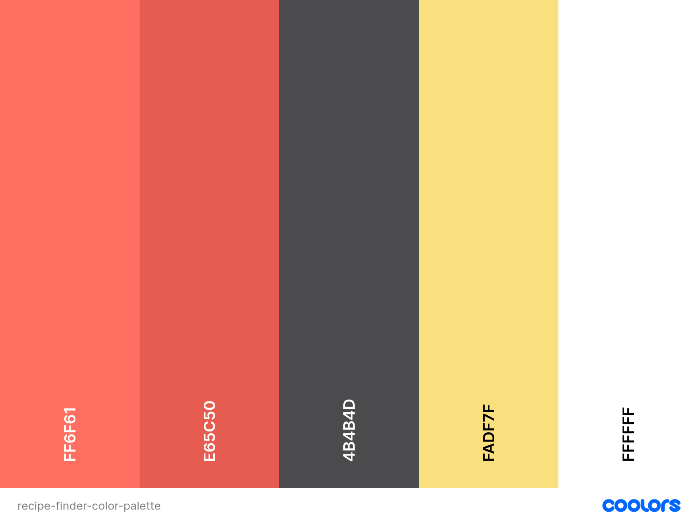
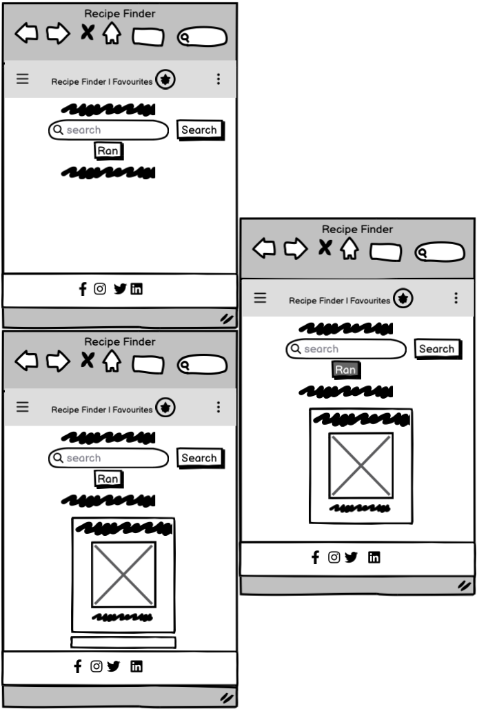
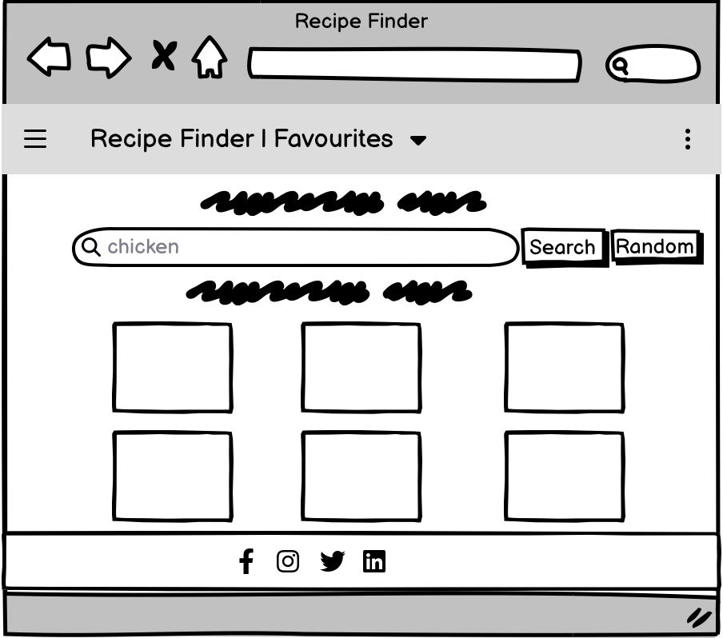
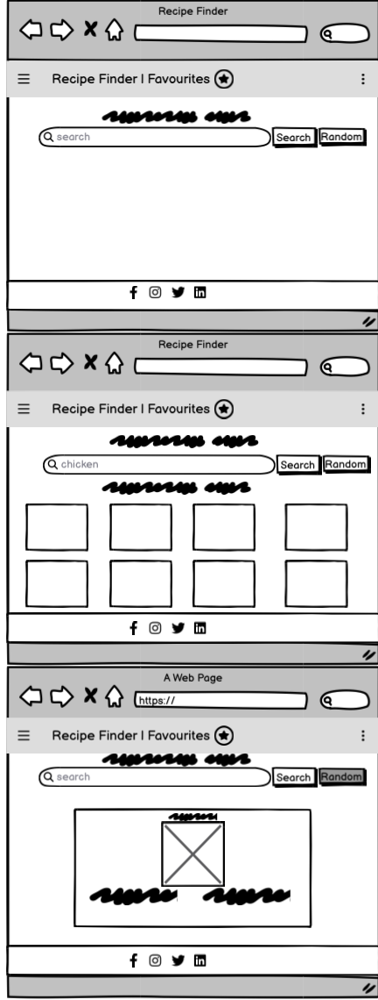

# Hackathon1 - Recipe Finder

# Overview

Recipe Finder is our first hackathon project implementing an interactive Front-End web application using HTML, CSS, and Javascipt as part of Code Institute's AI Augmented Full Stack Software Developer Bootcamp. Our project's main goal was to successfully connect to an API. We decided to make a recipe finder website and connect it to a Recipe API so that users can easily search and find recipes.

The live project can found here: <a href="https://emilyhugs.github.io/Hackathon1/" target="_blank">Live Project</a>

<h2 text-align="center" id="TOC">Table of Contents</h2>

- [Hackathon1 - Recipe Finder](#hackathon1-recipe-finder)
  - [Overview](#overview)
  - [Table of Contents](#TOC)
- [Project Planning](#project-planning)
  - [UX Design](#ux-design)
    - [User Stories](#user-stories)
    - [Colors](#colors)
    - [Fonts](#fonts)
    - [Wireframes](#wireframes)
- [Features](#features)
  - [Navbar](#navbar)
  - [Searchbar](#searchbar)
  - [Random Search Button](#random-search-button)
  - [Meal Cards](#meal-cards)
  - [Footer](#footer)
  - [Responsive Design](#responsive-design)
- [Deployment](#deployment)
- [Testing](#testing)
- [Content](#content)
- [Media](#media)
- [AI Implementation and Orchestration](#ai-implementation-and-orchestration)
- [Future Enhancements](#future-enhancements)
- [Collaborators](#collaborators)

<a href="#hackathon1-recipe-finder">Back To Top</a>

 

## Project Planning

To plan our project, we used a [miro board](https://miro.com/) where we could all visualise our ideas and slack for huddles/chatting via message.

<a href="#hackathon1-recipe-finder">Back To Top</a>

 

## UX Design

## User Stories

The user stories for this project as well as their acceptance criteria and tasks can be found in the <a href="https://github.com/users/Emilyhugs/projects/8/views/1" target="_blank">project board</a>.

- As a user, I want to access the website on any device (desktop, tablet, mobile) so that I can find recipes conveniently regardless of where I am.
- As a user, I want to search for meals by ingredients, meal name, or category so that I can quickly find recipes that match my preferences or available ingredients.
- As a user, I want to click on a meal and view more details (e.g., ingredients, instructions, meal image) so that I can understand how to prepare the meal.
- As a user, I want to save my favourite recipes so that I can easily find and access them later.
- As a user, I want a random recipe generator button so that I can explore new meal ideas without having to search for them.
- As a user, I want to rate and review recipes so I can provide feedback and see others' experiences.
- As a user, I want to create a shopping list based on the recipes so that I can easily get the ingredients I need to make them.
- As a user, I want to share recipes on social media so that I can show my friends and family what I'm cooking.
- As a user, I want to see nutritional information for each recipe, so that I can make informed dietary choices.
- As a user, I want to add a new recipe so that I can contribute my own recipes to the collection.

(Requires back-end development - future scope)

- As a user, I want to see a carousel of trending recipes so that I can see what is popular now.
- As a user who wants to use the website while I cook, I want to have tick boxes/ a progress tracker to keep track of what I've done and visually see how much progress I've made.

## Colors

We wanted the colours to be visually appealing, warm, and fresh.
To ensure the colour palette was accessible for our users, we checked with [Colour Contrast Checker](https://colourcontrast.cc/)(also available as extension on Chrome Web Store).

# Fonts

As with the color palette, we wanted the font to be visually appealing and easily readable for the users to ensure they have a positive experience visiting the website.
For this project, we used Merriweather Sans andOpen Sans fonts and implemented them via [Google Fonts](https://fonts.google.com) using a direct import code within the style.css file.

# Wireframes

The wireframes for this project have been created using [Balsamiq](https://balsamiq.com/). They show the key features that guided us in creating our website, ensuring responsiveness across different screen sizes.

**Mobile Wireframe**
These wireframes show the initial landing page, the recipe cards, and the random meal generator.

**Tablet Wireframe**
The tablet wireframes are similar to the desktop wireframes, except that the recipe cards show 3 in a row instead of four.

**Desktop Wireframes**
These wireframes show the initial landing page, the recipe cards, and the random meal generator.

<a href="#hackathon1-recipe-finder">Back To Top</a>

 
## Features

# Navbar

## Searchbar

The User can enter the recipe they want to find. Once they click search, the recipe API will return relevant recipes.

## Random search Button

We included this button so that the user can find a new recipe and be inspired by it instead of having to type something in the search bar.

## Meal Cards

## Footer

## Responsive Design

Here is what the website looks like on different screens:
 NOT DONE THIS YET

<a href="#hackathon1-recipe-finder">Back To Top</a>

 

## Deployment

Deploying fairly on is a good idea so you can regularly check if there are any bugs/obvious design flaws within a browser and test the website's responsiveness using Dev Tools.

The steps to deploy are as follows:

- Go to the Settings tab of your GitHub repo.
- On the left-hand sidebar, in the Code and automation section, select Pages.
- Make sure the source is set to 'Deploy from Branch'.
- Make sure the main branch is selected.
- Make sure the folder is set to / (root).
- Under Branch, click Save.
- Go back to the Code tab and wait a few minutes before refreshing.
- On the right-hand side in the Deployments section click on 'github-pages'.
- The latest deployed link will appear at the top of the page.

<a href="#hackathon1-recipe-finder">Back To Top</a>

 

## Testing

We tested and debugged the site regularly throughout the process, mainly using Chrome Dev Tools on the browser preview (but also on deployed website) to quickly identify errors.

### Validator Testing

[HTML Validation](https://validator.w3.org/)

[CSS Validation](https://jigsaw.w3.org/css-validator/)

[JS Validation](https://jshint.com/)

### Lighthouse

**Content**

**Media**

**AI Implementation and Orchestration**

## Future Enhancements

## Collaborators

Our lovely collaborators

 

<ul>
<li>[@Rickus316](https://github.com/Rickus316)</li>
<li>[@samira-hussein](https://github.com/samira-hussein)</li>
<li>[@Emilyhugs](https://github.com/Emilyhugs)</li>
</ul>
